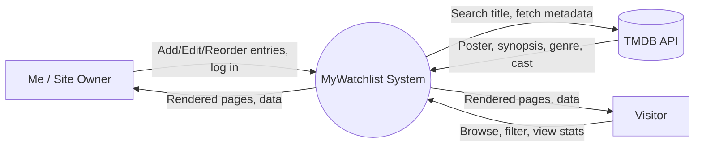

# Data Flow Diagram — MyWatchlist


## Level 0 — Context Diagram



## Level 1 — Process Breakdown

```mermaid
flowchart TB
    subgraph Client["Client (Browser)"]
        UI[Next.js Frontend]
    end

    subgraph Server["Server (Next.js API Routes)"]
        AUTH[1.0 Auth / Session Check]
        ENTRY[2.0 Entry Management\n(Create/Update/Delete/Reorder)]
        FILTER[3.0 Query & Filter Engine]
        STATS[4.0 Stats Aggregator]
        TMDBINT[5.0 TMDB Integration]
    end

    subgraph Data["Data Stores"]
        DB[(D1: Watch Entries DB\nPostgres)]
        CACHE[(D2: TMDB Response Cache)]
    end

    ExternalTMDB[(External: TMDB API)]

    UI -->|login request| AUTH
    AUTH -->|session token| UI

    UI -->|add/edit/delete/reorder entry| ENTRY
    ENTRY -->|write| DB
    DB -->|confirm| ENTRY
    ENTRY -->|updated entry| UI

    UI -->|search title| TMDBINT
    TMDBINT -->|check cache| CACHE
    TMDBINT -->|query if not cached| ExternalTMDB
    ExternalTMDB -->|metadata| TMDBINT
    TMDBINT -->|store| CACHE
    TMDBINT -->|metadata result| UI

    UI -->|filter/sort request\n(category, rating, status)| FILTER
    FILTER -->|read| DB
    DB -->|matching entries| FILTER
    FILTER -->|filtered list| UI

    UI -->|request stats| STATS
    STATS -->|read all entries| DB
    DB -->|entries| STATS
    STATS -->|aggregated stats\n(genre %, hours, ratings dist.)| UI
```

## Data Stores

| ID | Store | Contents |
|----|-------|----------|
| D1 | Watch Entries DB (Postgres) | title, type, genre(s), status (watchlist/currently-watching/watched), rating, notes, dates, TMDB id, poster URL, ranking (for Top 10 / Top 5) |
| D2 | TMDB Response Cache | Cached TMDB lookups, to reduce repeat API calls and speed up re-searches |

## External Entities
- **Me / Site Owner** — the only entity with write access (add, edit, delete, reorder).
- **Visitor** — read-only access (browse, filter, view stats, view Top 10/Top 5).
- **TMDB API** — external metadata source, queried only during entry creation/edit (search-and-fill), not on every page load.

## Key Data Flows Summary
1. **Add Entry Flow:** Owner searches title → TMDB Integration queries cache/API → metadata returned → owner confirms/edits → written to Watch Entries DB.
2. **Browse Flow:** Visitor requests library view with filters → Query & Filter Engine reads DB → filtered/sorted results rendered.
3. **Stats Flow:** Visitor/Owner opens stats page → Stats Aggregator reads all entries → computes genre breakdown, hours watched, rating distribution → renders charts.
4. **Status Transition Flow:** Owner moves an entry from Watchlist → Currently Watching → Watched (updates `status` and relevant date fields in place, no data re-entry).
